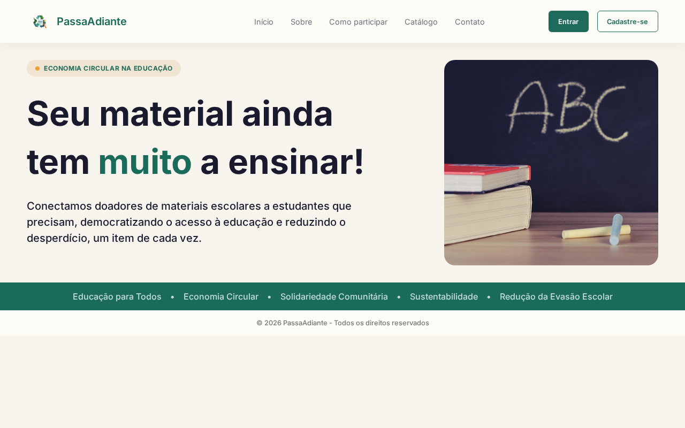
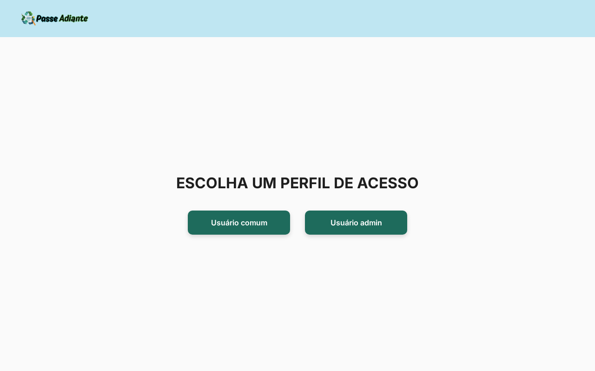
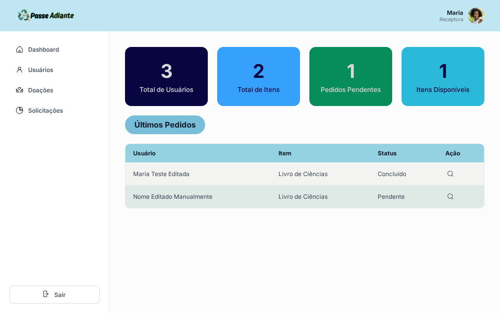
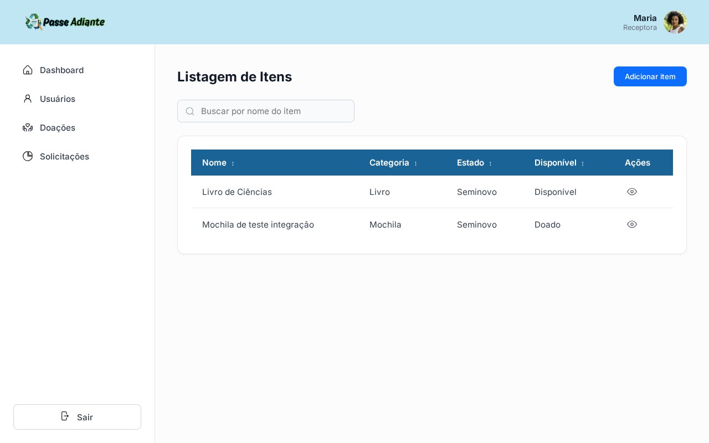
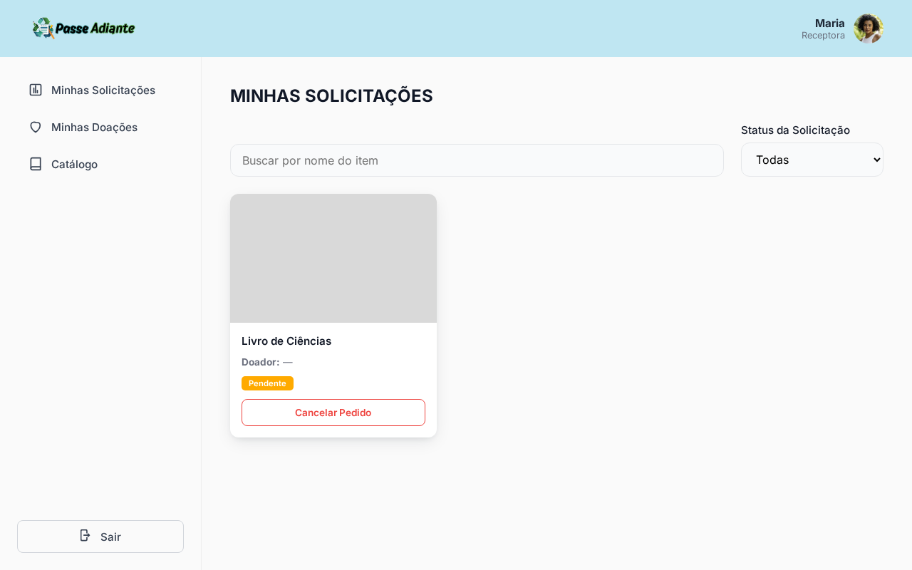
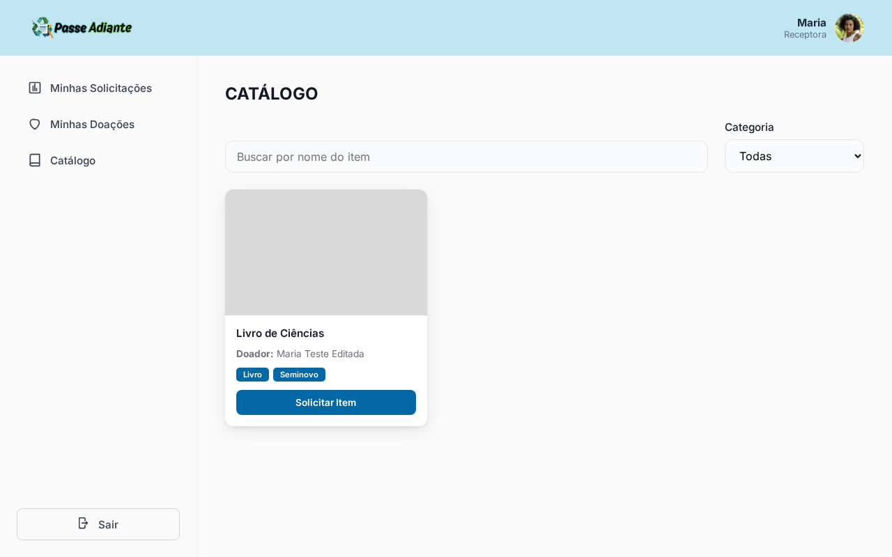

<p align="center">
  
</p>

<h1 align="center">Passa Adiante</h1>
<h3 align="center">Um caderno a menos parado, um estudante a mais preparado.</h3>

<p align="center">
  
  
  
  
  
</p>

## 📌 Sobre o Projeto

O **Passa Adiante** é uma plataforma web (front-end React + back-end NestJS) desenvolvida como **MVP** (Minimum Viable Product) para a disciplina Projeto Integrado III do curso de Análise e Desenvolvimento de Sistemas (ADS) da Universidade Federal do Cariri (UFCA). O objetivo é conectar pessoas que têm materiais escolares em bom estado (mas que não usam mais) a estudantes que precisam desses recursos, incentivando a reutilização, reduzindo desperdício e facilitando ações solidárias.

Este repositório é o **front-end** (React + Vite). A API que ele consome fica no repositório [PassaAdiante-NestJS](https://github.com/Matheus-Rodrigues-EC/PassaAdiante-NestJS).

### 🎯 Problema que a solução resolve

Muitas famílias possuem materiais escolares em bom estado que acabam descartados ou esquecidos, enquanto outras enfrentam dificuldade para conseguir itens básicos no início do ano letivo. Ao mesmo tempo, boa parte das plataformas de doação existentes têm processos complexos ou pouco intuitivos. O Passa Adiante busca resolver isso com uma plataforma simples, acessível e direta ao ponto.

### 👥 Público-alvo

Doadores (famílias, escolas, instituições) com material escolar disponível, e estudantes/famílias em situação de vulnerabilidade que precisam desses itens. A plataforma também serve comunidades, ONGs e projetos sociais que queiram organizar campanhas de reaproveitamento.

### ✨ Principais funcionalidades implementadas no MVP

- **Fluxo Usuário comum**: escolher perfil (sem login real, ver seção de instalação), navegar pelo catálogo de itens disponíveis e solicitar um item, acompanhar o status das próprias solicitações (pendente / aprovado / cancelado / concluído), e gerenciar as próprias doações (editar, excluir, ver e aprovar/recusar pedidos recebidos).
- **Fluxo Admin**: dashboard com indicadores gerais, listagem/CRUD de itens, listagem/aprovação de pedidos, listagem/edição de usuários.
- **Site institucional**: páginas públicas (Home, Sobre o Projeto, Catálogo público, Como Participar, Contato) reaproveitadas do site estático do projeto (ver seção abaixo).

### 🔗 Sobre o site institucional reaproveitado

As páginas públicas deste app (Home, Sobre, Como Participar, Contato, Catálogo institucional) foram portadas do repositório [passaadiante-site](https://github.com/holivane/passaadiante-site), o site estático (HTML/CSS/JS puro) desenvolvido para a disciplina de Desenvolvimento para Web. Como os dois projetos são da mesma iniciativa Passa Adiante, dentro do mesmo curso, essas páginas foram reescritas em React em vez de recriadas do zero.

## 🖥️ Visão Geral do Funcionamento

Sem sistema de login real no MVP (ver [Manual de Instalação](https://github.com/Matheus-Rodrigues-EC/PassaAdiante-NestJS/blob/main/docs/instalation-manual.md) do back-end para o motivo), o usuário escolhe um dos dois perfis de demonstração em `/escolher-perfil` e é redirecionado para a área correspondente:

- **Usuário comum** → Minhas Solicitações, Minhas Doações, Catálogo
- **Usuário admin** → Dashboard, Itens, Pedidos, Usuários

## 🎨 Protótipo de Alta Fidelidade

O protótipo foi desenvolvido no Figma, contemplando telas principais, fluxos de navegação, componentes reutilizáveis e identidade visual padronizada.

### 🔗 Link do Figma

[Fluxo de Usuário e Admin](https://www.figma.com/proto/9mB83YidYasilqkeB0G00v/Passa-Adiante?node-id=141-3916&p=f&t=YlcC3x7xXIyreTbI-0&scaling=contain&content-scaling=fixed&page-id=0%3A1&starting-point-node-id=141%3A3916&show-proto-sidebar=1) podem ser visualizados por aqui.

## 🛠️ Tecnologias Utilizadas

### Front-end (este repositório)

| Tecnologia | Uso |
|---|---|
| [React 19](https://react.dev/) | Biblioteca de UI: componentes e estado local das telas |
| [Vite](https://vitejs.dev/) | Build tool e servidor de desenvolvimento, pela velocidade de start/HMR |
| [react-router-dom](https://reactrouter.com/) | Roteamento entre as páginas (site público, área Admin, área Usuário) |
| [axios](https://axios-http.com/) | Cliente HTTP para consumir a API do back-end |
| CSS Modules (`*.module.css`) | Estilização isolada por componente, sem depender de uma lib de UI |
| [ESLint](https://eslint.org/) | Padronização e lint do código |

### Back-end ([PassaAdiante-NestJS](https://github.com/Matheus-Rodrigues-EC/PassaAdiante-NestJS))

| Tecnologia | Uso |
|---|---|
| [NestJS](https://nestjs.com/) | Framework da API, pela estrutura modular (Controller → Service → Repository) |
| [Prisma ORM](https://www.prisma.io/) (+ `@prisma/adapter-pg`) | Acesso tipado ao banco, migrations |
| [PostgreSQL](https://www.postgresql.org/) | Banco de dados relacional |
| [bcrypt](https://www.npmjs.com/package/bcrypt) | Hash de senha dos usuários |
| [class-validator](https://github.com/typestack/class-validator) | Validação dos DTOs de entrada da API |
| [Jest](https://jestjs.io/) | Testes automatizados |

### Versionamento

Git + GitHub, com Issues organizadas na milestone **MVP Web Funcional**, uma branch por issue e Pull Request para revisão antes do merge (mais detalhes na seção "Processo de Desenvolvimento" abaixo).

> Não há autenticação/login real neste MVP: o perfil escolhido em `/escolher-perfil` associa a sessão a um de dois usuários fixos de demonstração (seed do back-end), guardado no `localStorage` do navegador. Login de verdade (JWT) fica fora do escopo desta entrega.

## 📂 Estrutura do Projeto

### Front-end (este repositório)

```text
src/
├── assets/          # Imagens, ícones, logo
├── components/      # Componentes compartilhados (Header, Footer, Layout, Select customizado)
├── layouts/         # Layouts das áreas logadas (AppLayout = Admin, UserLayout = Usuário comum)
├── pages/
│   ├── (site)        # Páginas públicas: Home, SobreOProjeto, Catalogo, ComoParticipar, Contato
│   ├── EscolherPerfil/
│   ├── app/          # Telas do Admin: Dashboard, ListagemItems, PaginaItem, ListagemPedidos,
│   │                  #   PedidoDetalhe (+ PedidoAguardandoAprovacao/Conclusao), ListagemUsuarios, PaginaUsuario
│   └── user/          # Telas do Usuário comum: MinhasSolicitacoes, MinhasDoacoes, EditarDoacao,
│                       #   SolicitacoesDoacao, Catalogo
├── services/         # Chamadas à API (itemsService, ordersService, usersService) + api.js (axios) + currentUser.js
├── data/             # Opções de enum (categoria/condição/disponibilidade de item, status de pedido) e seus labels em PT-BR
└── routes.jsx        # Definição de todas as rotas da aplicação
```

Cada tela dentro de `pages/app` e `pages/user` fica em sua própria pasta, com o componente `.jsx` e seu CSS Module (`.module.css`) lado a lado.

### Back-end

A estrutura e a arquitetura em camadas (Controller → Service → Repository) do back-end estão detalhadas em [docs/architecture-and-organization.md](https://github.com/Matheus-Rodrigues-EC/PassaAdiante-NestJS/blob/main/docs/architecture-and-organization.md), no repositório da API.

## ▶️ Instalação e Execução

O app depende da API rodando localmente. É preciso clonar e configurar os **dois** repositórios.

### 1. Back-end (API)

Siga o [Manual de Instalação](https://github.com/Matheus-Rodrigues-EC/PassaAdiante-NestJS/blob/main/docs/instalation-manual.md) do repositório `PassaAdiante-NestJS`. Resumindo: clonar, `npm install`, configurar `.env` (`DATABASE_URL` + `FRONTEND_URL`, com um Postgres local ou via Docker), `npx prisma generate`, `npx prisma migrate dev`, `npx prisma db seed` (cria os dois usuários fixos de demonstração) e `npm run start:dev`. A API sobe em `http://localhost:3000`.

### 2. Front-end (este repositório)

```bash
git clone https://github.com/Matheus-Rodrigues-EC/Passa-Adiante-ReactJS.git
cd Passa-Adiante-ReactJS
npm install
```

Configure a variável de ambiente:

```bash
cp .env.example .env
```

A variável `VITE_API_URL` deve apontar para o back-end rodando localmente (padrão `http://localhost:3000`). Sem esse arquivo, as chamadas à API não funcionam.

Rode o servidor de desenvolvimento:

```bash
npm run dev
```

### 3. Acessando o sistema

Abra `http://localhost:5173` (o Vite escolhe automaticamente a próxima porta livre, ex. `5174`, se a 5173 já estiver em uso). A partir da Home, use "Entrar" ou navegue direto para `/escolher-perfil` para acessar a área Admin ou Usuário comum de demonstração.

## 🔧 Processo de Desenvolvimento

- **Equipe**: Holivane Holanda, Sara Ferreira e Matheus Rodrigues.
- **Divisão de tarefas e GitHub**: o trabalho foi quebrado em Issues, uma por tela/funcionalidade, agrupadas na milestone **MVP Web Funcional**. Cada Issue vira uma branch (`feat/<n>-descricao` ou `fix/<n>-descricao`) e um Pull Request para revisão antes de ir para `main`, sem merge direto na branch principal.
- **Estratégia de versionamento**: commits no padrão [Conventional Commits](https://www.conventionalcommits.org/) (`feat:`, `fix:`, `docs:`...). O back-end reforça isso com `commitlint` + Husky.
- **Dificuldades encontradas e soluções adotadas**:
  - Sem tempo/escopo para autenticação real no MVP, resolvido com um mecanismo de "usuário atual" simples (dois usuários fixos de demonstração, seed do Prisma, `localStorage` no front) que simula os dois perfis sem exigir login.
  - Front e back rodando em portas/origens diferentes durante o desenvolvimento local, resolvido configurando CORS no NestJS (`FRONTEND_URL`) para aceitar a origem do Vite.
  - Um bug de restrição de chave estrangeira do banco (erro genérico 500 ao excluir um item que já tinha pedido associado) foi identificado durante testes manuais da integração e corrigido no back-end, passando a devolver uma mensagem de erro clara (409) nesse caso.

## 📸 Demonstração do MVP

### Tela inicial (site institucional)



### Escolher Perfil (entrada para as áreas logadas)



### Dashboard (Admin)



### Listagem de Itens (Admin)



### Minhas Solicitações (Usuário comum)



### Catálogo (Usuário comum)



## 🧠 Decisões Tomadas Durante o Desenvolvimento

Durante o desenvolvimento do MVP, a equipe tomou diversas decisões visando melhorar a experiência do usuário e a organização visual da plataforma.

### Design Centrado no Usuário

Toda a construção da interface foi baseada na metodologia de Design Centrado no Usuário, priorizando:

- Facilidade de navegação.
- Clareza das informações.
- Simplicidade visual.
- Acessibilidade.

---

### Redução da Carga Cognitiva

As interfaces foram projetadas para evitar:

- Excesso de informações.
- Poluição visual.
- Menus complexos.
- Ações desnecessárias.

O foco foi permitir que o usuário compreenda rapidamente:

- Onde está.
- O que pode fazer.
- Como concluir determinada ação.

--- 

### Consistência Visual

Foi criada uma identidade visual padronizada utilizando:

- Paleta de cores consistente.
- Tipografia uniforme.
- Componentes reutilizáveis.
- Padrões modernos de interface.

Isso ajuda a reduzir a curva de aprendizado e melhora a familiaridade do usuário com o sistema.

### Arquitetura de Informação

As funcionalidades foram organizadas de maneira lógica para:

- Facilitar a localização de informações.
- Otimizar fluxos.
- Minimizar cliques.
- Evitar confusão durante a navegação.

### Processo Iterativo

O desenvolvimento ocorreu de forma colaborativa e iterativa:

- Criação inicial das telas.
- Coleta de feedbacks.
- Refinamento do design.
- Validação dos fluxos.
- Ajustes finais.

Os comentários e revisões foram realizados diretamente no Figma, permitindo alinhamento contínuo entre todos os integrantes da equipe.

## 🌎 Possíveis usos da nossa solução

O **Passa Adiante** pode ser utilizado por:

- Comunidades locais.
- ONGs.
- Instituições beneficentes.
- Projetos sociais.
- Grupos de bairro.
- Pessoas interessadas em economia colaborativa.

A solução pode ajudar tanto indivíduos quanto organizações a:

- Reduzir desperdícios.
- Incentivar reutilização.
- Facilitar doações.
- Ampliar ações solidárias.
- Conectar pessoas com necessidades reais.

Além disso, o sistema pode servir como base para futuras implementações voltadas ao impacto social e sustentabilidade.

## 💡 Importância da Experiência do Usuário (UX)

A Experiência do Usuário (UX) possui papel fundamental no sucesso de qualquer sistema digital. Uma interface bem planejada não apenas melhora a aparência visual da aplicação, mas também facilita a utilização do sistema, reduz erros e aumenta a satisfação do usuário.

Quando um sistema é intuitivo e acessível:

- As pessoas conseguem utilizá-lo com mais facilidade.
- A curva de aprendizado diminui.
- O usuário sente mais confiança durante a navegação.
- Aumenta a chance de adoção da plataforma no mundo real.

No contexto do **Passa Adiante**, investir em UX foi essencial para garantir que qualquer pessoa, independentemente do nível de familiaridade com tecnologia, consiga utilizar a plataforma de maneira simples, rápida e eficiente.

## 📋 Critérios de Desenvolvimento Atendidos

✔ MVP funcional (front-end + back-end integrados)

✔ Consistência visual

✔ Aplicação de princípios de UX/UI

✔ Navegação intuitiva

✔ Arquitetura de informação organizada

✔ Documentação do projeto

✔ Organização no GitHub (Issues, milestone, PRs)

✔ Processo colaborativo de desenvolvimento

✔ Foco em acessibilidade e usabilidade
